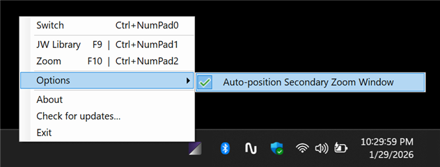
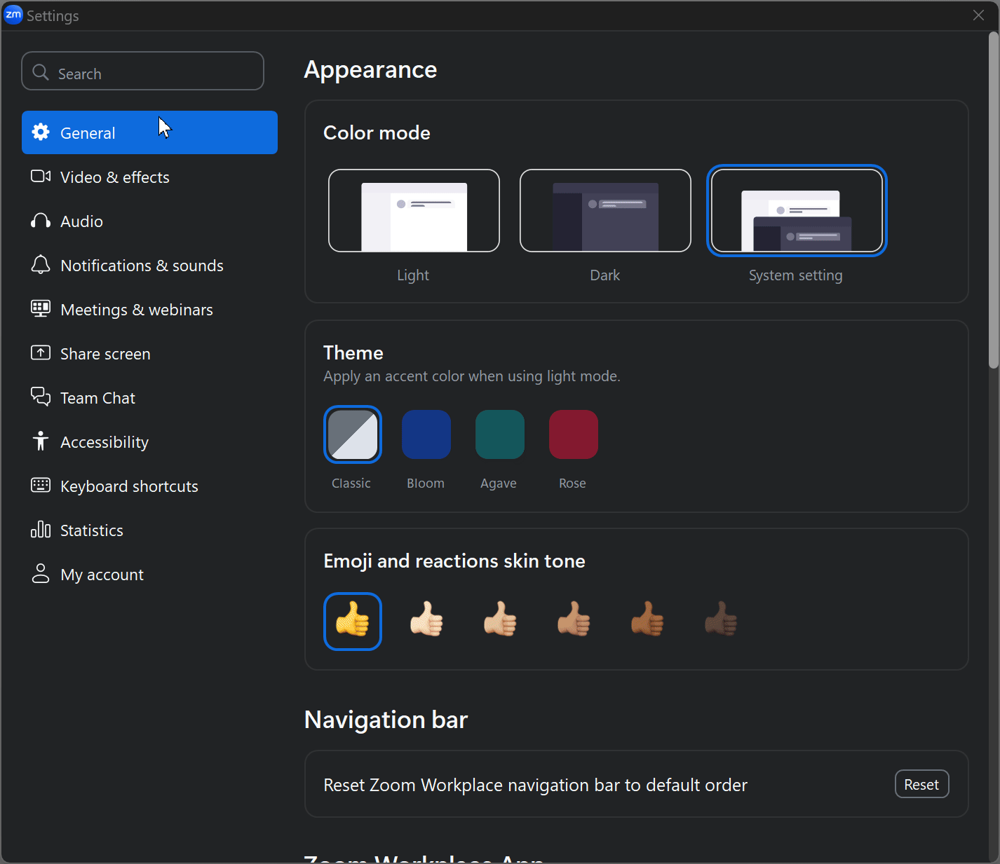
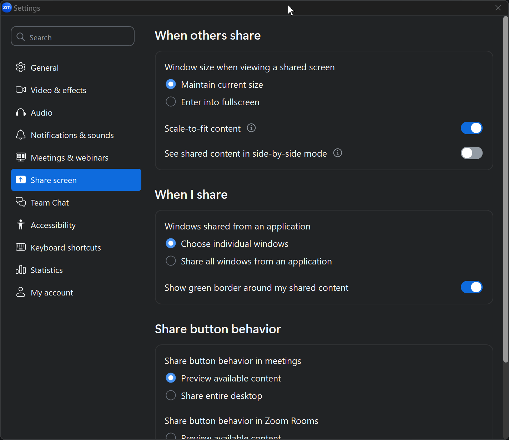

# Displayed App Switcher

Appears as a system tray icon:  when run.

This tool manages which app — JW Library or Zoom — appears on the second monitor. When switching to Zoom, it _moves_ (can be turned off) Zoom's secondary window to that monitor enlarging it to full screen and minimizes JW Library; switching back restores the previous state.

* Supported OS:
  * Windows 11 (64bit)
  * Windows 10 (64bit)
* Runtime: **.NET 8.0 (LTS)** - the runtime is embedded, so .NET does not need to be installed separately.

## Installation

* Download the latest release from the [Releases](https://github.com/viaart/DisplayedAppSwitcher/releases) section - the `DisplayedAppSwitcher_<version>_Setup.exe` file.
* Run the `Setup` file and follow installation prompts.
* Run the  Displayed App Switcher either from the desktop link, or the Start menu.
* (Optional) Make the tray icon always visible for easy access:
  * Drag the icon from the hidden icons popup onto the system tray.
  * Or search for "Control which system tray icons appear on the taskbar" setting and toggle the switch.

## Update

* The tool notifies you when a new version is available.
  * Auto-updating is coming soon.
* Uninstall this tool when it's no longer needed.

## Usage 

The **Displayed App Switcher** icon  sits in the system tray when run. There is a context menu with available commands that becomes visible when right clicking on the tray icon.

Currently the shortcuts are assigned as follows:

* Switch to the next:
    * `Ctrl-NumPad 0`
    * Double click the tray icon.
* Switch to JW Library:
    * `Ctrl-NumPad 1`
    * `F9`
* Switch to Zoom:
    * `Ctrl-NumPad 2`
    * `F10`

### Options

Right-click the tray icon and navigate to the **Options** submenu to access additional setting:

* **Auto-position Secondary Zoom Window** - When enabled, automatically moves the secondary Zoom window to the secondary monitor if it appears on the wrong display. This is useful because Zoom's secondary window tends to appear on the primary monitor after starting or joining a meeting.

## Setup

### JW Library

Make sure to turn on "Play video on a second display" in the settings in the JW Library app. Switching it off and back on helps to resolve some secondary window disappearance issues.

### Zoom

To access Zoom settings, right-click the Zoom tray icon and select "Settings", or click on the Zoom main window and look for the settings (gear) icon.

Under the "Meetings & webinars":

- [x] "Use dual monitors"
  > [!WARNING] If you don't enable dual monitors, pressing `F10` will reveal a blank window, a sign that the settings was not turned on. This tool is unnecessary if you don't use dual monitors, so make sure to turn it on.
- "Enter full screen automatically":
  - [ ] Leave off if you are planning on using the Auto-Positioning feature
  - [x] Check on if you prefer to have the secondary Zoom window go full screen automatically when joining a meeting.
- [x] "Always show meeting controls"

  
“Use dual monitors” does not change behavior during the meeting, so it is vital to start or join with the “Use dual monitors” turned on beforehand.

> Currently Zoom completely disables participants video grid during sharing in the “Use dual monitors” mode, there is no Side-by-side setting available.

If you switch to Zoom using this utility before starting the Zoom's meeting, Zoom's window that is internally designated for the dual screen will show up as a blank canvas. This is totally harmless and is easily fixed by starting the meeting or tapping `F9`.

Initially Zoom's dual monitor window needs to be dragged to the secondary monitor and double clicked, anywhere inside the window, to make it full screen. It has no meeting controls, which makes it distinguishable from the other Zoom windows. Double clicking has to be done every time the Zoom starts or joins a meeting, if "Enter full screen automatically when starting or joining a meeting" is not checked in the settings.

During initial setup, other Zoom controls and windows may need to be moved to the desired locations, including share screen toolbar, but Zoom seems to remember at least the monitors on which the controls should stay, so this is a one time action.

## Problem Description

1. Although the Zoom application supports dual-monitor mode, screen sharing is problematic when JW Library and Zoom, in full screen mode, are being used on the secondary display(s). When the screen share begins, Zoom’s secondary window jumps to the primary screen and completely covers it. This makes it difficult to access the JW Library app to play media.

2. Moreover, when screen sharing is done, Zoom window doesn't restore itself to the secondary screen behind the JW Library window.

3. When JW Library crashes, a Zoom participant may accidentally show on the wall screens.

4. Most of the time, JW Library should be seen on the secondary monitor, but Zoom's window tends to cover it due to some Z-sorting or window priority issues. JW Library's second window may suddenly go to a minimized mode when Share Screen is initiated.

5. It can be cumbersome to use the Windows Taskbar to switch between the two apps, since there are multiple icons for both JW Library and Zoom pinned to the Taskbar. Attempts to find the right window create unnecessary pauses, or misclicks. Ideally, a well known keyboard shortcut to quickly perform the switch would help, but none of them are provided by either Zoom or JW Library.

## Solution Overview

This tool completely hides the secondary Zoom window from the system when requested to switch to JW Library with `F9`. In fact the toolbar icon that corresponds to it also disappears. If JW Library crashes or minimizes, Zoom participant does not show on the second monitor. When switching back to Zoom with `F10`, **Displayed App Switcher** restores the hidden Zoom window to its previous visible state. 

An attempt to share screen with the hidden secondary Zoom window also helps, as there is nothing to move to the main screen, as otherwise happens when it is not hidden. Zoom window stays hidden and waits to be shown back. When requested to be shown, Zoom window automatically retains its full screen mode without any additional action. The tool simultaneously minimizes the secondary JW Library window to improve predictability. This tool never attempts to hide JW Library's secondary window (and in fact it does not seem to be possible).

**Displayed App Switcher** is _not_ maintaining the state of the applications constantly, but instead only once during an actual request. This is to avoid too much meddling into the behavior of both applications.

## Still needed?

I evaluate the necessity of this tool as Zoom and JW Library receive updates. So far, the behavior remains unchanged.

Ideally, Zoom will eventually address the secondary window jumping issue, and JW Library will provide a more reliable way to stay on top when other applications compete for focus. If these improvements are made, **Displayed App Switcher** will no longer be needed.

## Tested Versions

### Windows

* **Windows 10 (64bit) / 11 (64bit)**

### JW Library

| Version           | Displayed App Switcher |
| ----------------- | ---------------------- |
| 15.6.59 (749930)  | `v1.4.0`               |
| 15.2.54 (588452)  | `v1.3.3`               |
| 15.0.398 (536532) | `v1.3.2`               |
| 14.3.45 (429479)  | `v1.3.1`               |
| 13.1.58 (170209)  |                        |
| 13.0.146 (157716) |                        |

### Zoom Workspace

| Version        | Displayed App Switcher |
| -------------- | ---------------------- |
| 6.7.2 (26346)  | `v1.4.0`               |
| 6.3.11 (60501) | `v1.3.3`               |
| 6.2.7 (49583)  | `v1.3.2`               |
| 6.0.11 (39959) | `v1.3.1`               |

### Original Zoom

| Version       |
| ------------- |
| 5.11.1 (6602) |
| 5.10.7 (6120) |
| 5.10.6 (5889) |
| 5.10.4 (5035) |
| 5.10.3 (4851) |
| 5.10.1 (4420) |
| 5.10.0 (4306) |
| 5.9.7 (3931)  |
| 5.9.3 (3169)  |
    
## TODO

The following things could be done to improve the tool:

- [ ] Monitor for new Zoom PID in case it crashes to restore the last state.
- [ ] Auto Building.
- [ ] Auto Update.
- [x] Notification Of New Versions.
- [ ] Custom keyboard shortcuts.
- [x] Different behaviors depending on JW Library / Zoom versions.
- [ ] Turn it into a universal tool with configurations.
- [x] Sign the installer to eliminate security warnings during download and installation.

## Changelog

- v1.5.0
  - Setup is now signed and trusted by Microsoft
  - Upgraded to .NET 8.0 — the runtime is now embedded, so .NET no longer needs to be installed separately
  - Updated dependencies
  - Installation moved to AppData to avoid falsely reported completed upgrades and no longer requires administrator privileges
  - Minor Improvements
    - Updated README with current Zoom screenshots and up-to-date instructions
- v1.4.1
  - Fix auto-positioning to be more precise by looking for JW Library's secondary window more carefully
- v1.4.0
  - Add support for Zoom 6.7.2
  - Add automatic positioning of the secondary Zoom window to the secondary monitor if it is not there
- v1.3.3
  - Updated logic to discover new versions of JW Library
- v1.3.2
  - Implement new logic to address naming changes in JW Library
- v1.3.1
  - Make setup show uninstall dialog of the previous version instead of a doing it quietly
- v1.3.0
  - Check for updates upon wake up from hibernation or sleep
- v1.2.0
  - Update for Zoom Workspace
  - Check for new versions with menu and when the app starts
- v1.0.4 - Change keys `F5` & `F6` shortcuts to `F9` & `F10` as `F5` is clashing with the refreshing command
- v1.0.3 - Fix Zoom simply flashing when asked to go to the fore
- v1.0.2 - Filter out third Zoom window when the meeting is not running
- v1.0.0.1 - Singleton - only one app allowed to run at a time

## How Auto-positioning Works

Zoom's secondary window almost always appears on the wrong monitor (typically the primary one) after starting or joining a meeting. The auto-position feature solves this by detecting where JW Library's secondary window is displayed and moving Zoom's secondary window to that same monitor.

Here's what happens when you press `F10` (switch to Zoom):

1. The tool finds JW Library's secondary window and detects which monitor it's on.
2. If auto-positioning is enabled, the tool moves Zoom's secondary window to that monitor in full-screen mode.

This detection happens fresh every time you press `F10`, ensuring both applications always use the same "presentation" monitor without manual intervention.

Take note of the following:

* **Never minimize the main Zoom window**, otherwise the secondary Zoom window will also be restored from its hidden state when Zoom is asked to Exit Minimized Video - and this will cover the JW Library on the secondary screen. If that happened by accident, tap `F9` to return to a JW Library mode.
* If Zoom accidentally crashes, it will restore itself, and rejoin the meeting as Host. At that moment Zoom's secondary window will take over. It's a good idea to be ready to quickly tap `F9` while this is happening to prevent a random user being seen.
* If during an attempt to share screen JW Library accidentally hides, click `F9` to bring it back. This can be done even while the Share Screen dialog is up or right after starting the share. The video doesn't start playing until the secondary window is brought back to vision.

> [!TIP] To further improve reliability of switching, a physical device, such as Elgato "Stream Deck" can be obtained. Buttons on such a deck can be assigned to playback keyboard shortcuts, and with modified pictures & labels on the buttons make it even quicker to perform an action.

## Tips & tricks

### Zoom :: Green border removal

To eliminate the green border that sometimes surrounds the shared screen / window, remove the corresponding checkbox under the Zoom settings > Share Screen > Advanced.

### Windows :: Disable window animation

Currently, this utility **minimizes** JW Library when showing the Zoom window and restores it back, which makes it transition visibly between the states. This animation can be disabled for all the windows in the system through the Advanced system settings:

* Start typing in Window search (Win+S): `Advanced System Settings` and select `View advanced system settings` (Control Panel) as soon as you see it.

* Go to `Advanced` Tab, and under the first box called `Performance`, click `Settings...`.

    

* In the Performance Options, uncheck the `Animate windows when minimizing and maximizing`.

    

* Keep clicking OK until all the setting windows are closed.

## Build from source

To build from source, clone the repository and open `*.csproj` in "Microsoft Visual Studio 2022". Community Edition is enough to compile and use this open source project.

## New version release steps

### Release

* Ensure you are logged in to Azure CLI: `az login` (once per session).
* Abort running Displayed App Switcher.
* `mise run release`, enter the version number.
  * This will:
    * Update the version number in 3 files.
    * Call Publish through `dotnet` which outputs to `bin\Release\net8.0-windows\publish`.
    * Sign the published executable and DLL with Azure Trusted Signing.
    * Run `InnoSetupScript.iss` which outputs generated Setup to `Setup` folder (Setup exe and uninstaller are also signed).
    * Verify all signatures (exe, dll, and installer).
* Commit & push changes, tag the commit.
* Release from the tag, upload generated Setup from `Setup` folder.
